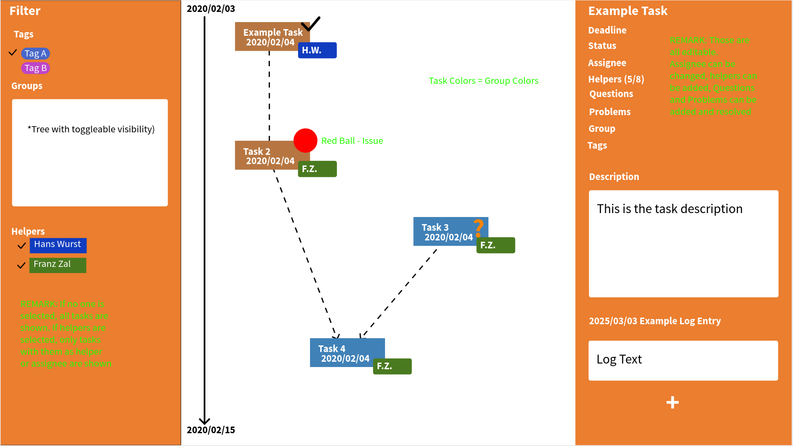

# Machma

Machma is a lean, text-based task management tool for events and projects. It runs as a native desktop app (Electron) with no backend — all data lives in plain Markdown and JSON files on your local filesystem.

## Key Features

- **Text-file based**: All project data is stored as `.md` and `.json` files. Edit them with any text editor, version-control with git, and use Machma's UI for visual management.
- **Timeline view**: Interactive graph showing tasks as colored nodes on a vertical timeline, with dependency arrows, pan/zoom, and smart density-aware spacing.
- **Tasks view**: Sortable task table with columns for title, group, deadline, assignee, helpers, status, issues, questions, and a truncated description preview.
- **Rich filtering**: Filter by deadline proximity, status, tags, groups, helpers, unresolved issues, and unanswered questions.
- **Task detail editing**: Click any task to open a side panel with metadata fields, markdown description, questions, issues, and log entries — all editable inline.
- **Live sync**: Polls for external file changes every 3 seconds, so edits made in a text editor or via git are reflected automatically.
- **No backend**: Pure desktop app using Electron + Node.js `fs`. No server, no database, no Docker.
- **Responsive**: Desktop three-panel layout with collapsible sidebars; mobile full-screen overlay panels.

## Installation

### Prerequisites

| Requirement | Minimum version | Notes |
|-------------|-----------------|-------|
| [Node.js](https://nodejs.org/) | 18 LTS | Includes `npm`. Use the LTS release for best compatibility. |
| [git](https://git-scm.com/) | any recent | Only required to clone the repository. |

### Install from a pre-built package

Pre-built binaries for Linux, macOS, and Windows are attached to each [GitHub Release](../../releases). Download the package for your platform and install it:

| Platform | File | How to install |
|----------|------|----------------|
| Linux (Debian/Ubuntu) | `machma_*.deb` | `sudo dpkg -i machma_*.deb` |
| Linux (Fedora/RHEL)   | `machma-*.rpm` | `sudo rpm -i machma-*.rpm` |
| macOS  | `machma-*.zip` | Unzip and drag `Machma.app` to `/Applications` |
| Windows | `machma-*.exe` | Run the `.exe` — it silently installs and launches the app |

### Install from source

```bash
# 1. Clone the repository
git clone https://github.com/<owner>/machma.git
cd machma

# 2. Install dependencies (takes ~1–2 minutes on first run)
npm install

# 3. Launch the app in development mode
npm run dev
```

> **Tip:** The `example_project/` directory included in the repository is a ready-to-use demo project. Point the app at it on first launch (see below).

## First Start

1. **Launch the app** — either by running `npm run dev` (from source) or opening the installed application.
2. **Open a project** — click **"Open Project Folder"** on the landing screen and select a directory that contains a `project.json` file.
   - To explore a working demo right away, select the **`example_project/`** folder inside the cloned repository.
3. **Navigate** — the top navigation bar gives access to all seven views: Timeline, Tasks, Issues, Questions, Helper List, Helpers, and Entities.
4. **Recent projects** — the last 5 opened project folders appear on the landing screen for quick one-click access. This list is persisted across restarts.

### Creating your first project from scratch

A Machma project is just a directory. The only required file is `project.json`:

```json
{
  "name": "My Project",
  "anchor_date": "2026-01-01"
}
```

Create that file in an empty folder, open the folder in Machma, and start adding tasks via the **"+ New Task"** button in the top bar. Machma will create the necessary subdirectory structure for you as you add tasks and groups.

## Development & Building

### Running in development mode

```bash
npm run dev   # Launches Electron with Vite HMR (hot module replacement)
```

### Building a distributable package

```bash
npm run make   # Packages for the current OS → out/make/
```

Output artefacts:
| Platform | Output                        |
|----------|-------------------------------|
| Windows  | Squirrel `.exe` (silent install + launch) |
| macOS    | ZIP archive (`.zip`)          |
| Linux    | `.deb` and `.rpm` packages    |

### Releasing via GitHub Actions

Releases are built for all three platforms automatically when you push a version tag:

```bash
# Bump the version in package.json, commit, tag, and push
npm version patch     # or minor / major
git push origin main --tags
```

The [release workflow](.github/workflows/release.yml) triggers on `v*.*.*` tags, runs `npm run make` on Ubuntu, macOS, and Windows in parallel, then publishes all artefacts to a **draft** GitHub Release. Review it and publish manually.

Before the first release:
1. Open `forge.config.ts` and set your GitHub repository owner in `publishers[0].config.repository.owner`.
2. Ensure `GITHUB_TOKEN` is available (GitHub Actions provides it automatically; for local runs: `export GITHUB_TOKEN=<your PAT>`).

## UI Overview



The app has seven views, accessible via the top navigation bar:

### Timeline
A React Flow canvas showing tasks as nodes positioned on a vertical date axis. Each node is colored by its group, shows the task title, resolved deadline, assignee initials, and indicators for unresolved issues (red dot) and unanswered questions (orange "?"). Dependency arrows connect tasks — colored by the parent task's status (yellow = in progress, green = finished, red = cancelled, gray = todo) so you can instantly see which blockers are resolved. A left filter panel and right detail panel can be opened/closed. Groups are ordered horizontally by dependency connectivity (connected groups are placed adjacent), and tasks within the same group automatically spread into sub-lanes when they share similar deadlines, preventing overlap while keeping related dependency chains vertically aligned.

**Interactive dependency editing**: Drag from a node's bottom handle to another node's top handle to create a dependency. Select a dependency edge and press Delete/Backspace to remove it. Connection validation prevents self-references and duplicates.

**Keyboard shortcuts**: Press Ctrl+F to fit all visible tasks into the viewport (same as the fit-view button in the controls). Works regardless of whether the mouse is over the canvas, filter panel, or detail panel.

**Stable timeline axis**: The vertical date axis always spans the full date range across all tasks, regardless of active filters. This means task Y positions and the timeline itself stay fixed when toggling filters — the user always keeps temporal orientation. Filtered-out tasks simply disappear from the canvas; they don't shift the remaining nodes' positions.

**Day-view mode**: When the deadline date range filter covers 1–2 days, the timeline automatically switches to a high-resolution day view with hourly tick marks (instead of daily/weekly). Tasks with different time-of-day values are positioned at visually distinct vertical positions, enabling fine-grained scheduling within a single day.

**Start date duration lines**: When a task has a start date set, the task node is drawn at the start date position (not the deadline). A vertical line extends downward from the node to the deadline position, ending in a horizontal T-bar (box-plot style). This visually represents the task's time span on the timeline. If only `start_time` is set (no `start_date`), the deadline's date is assumed — the task starts at that time on the same day. This inference is rendering-only and never written back to the .md file.

**Vertical drag-and-drop**: Drag any task node up or down on the timeline to reschedule it. The node is constrained to vertical movement only. In normal view, the dropped position snaps to the nearest day; in day-view mode, it snaps to the nearest 15-minute interval. For tasks with a start date, dragging moves the start date and the deadline shifts by the same amount so the task's duration is preserved. For tasks without a start date, dragging directly moves the deadline. Relative deadlines (e.g. `-5d`) are converted to absolute dates when dragged.

### Tasks
A sortable table of all tasks. Click column headers to sort. Columns: title, group (color dot), deadline, start date, assignee (inline editable dropdown showing initials), helpers (assigned/needed), status (badge), issues, questions, and a truncated description preview. The assignee column is directly editable — click the dropdown to change the assignee without opening the detail panel. Click a row to open the task detail panel. When sorting by deadline or start date, blocks of 2+ tasks on the same day are visually separated by empty rows for readability.

### Issues
A flat sortable table of all issues across all tasks. Each row represents one issue, with columns: name, task (parent), group, deadline, task assignee, issue assignee, status (resolved/unresolved), and task description. The filter panel can filter by issue status (resolved/unresolved/both), issue assignee, task assignee, task group, and task deadline proximity. Clicking a row opens the issue detail panel (not the full task). From the issue detail panel, clicking the task name opens the full task detail in-place with a back button to return.

### Questions
A flat sortable table of all questions across all tasks. Each row represents one question, with columns: name, task (parent), group, deadline, task assignee, status (answered/unanswered), answer (truncated), and task description. The filter panel can filter by question status (answered/unanswered/both), task assignee, task group, and task deadline proximity. Clicking a row opens the question detail panel (not the full task). From the question detail panel, clicking the task name opens the full task detail in-place with a back button to return.

### Helper List
A task-centric view for managing helper assignments. Shows all tasks that require helpers as individual cards, sorted by deadline. Each card displays the task header (group, title, deadline, status, and a green/amber fill indicator showing assigned vs. required helpers). Below the header, an editable "required helpers" field and a table of assigned helpers (with remove buttons) allow quick management. A dropdown adds unassigned helpers. Clicking a task card header opens the task detail panel. The shared filter panel (groups, deadline, status, tags, etc.) applies to the task list.

### Helpers
Inline-editable table for managing internal helpers (`helpers.json`). Add, edit, or remove people with name, role, email, phone, address, and a custom display color (via color picker). The `role` field is a free-text descriptor (e.g. "core member", "volunteer") for organizational purposes. The helper's color is used for their assignee badge on timeline nodes and their dot indicator in filter panels.

### Entities
Inline-editable table for managing external contacts and organizations (`external_entities.json`).

## Interaction Concepts

### Filtering
The left filter panel (toggle via the filter icon) provides:
- **Deadline**: date range filter with From/To date pickers and preset buttons (All, Anchor, 7d, 14d, 30d, 90d). The "Anchor" preset shows the project's anchor date as a single day (triggers day-view mode). Time-based presets fill in today as start and today+N days as end. You can also manually enter arbitrary date ranges. Filtering to a single day or 2-day range triggers the timeline's day-view mode with hourly ticks.
- **Flags**: checkboxes for "has unresolved issues" and "has unanswered questions"
- **Status**: toggle chips (todo, in progress, finished, cancelled)
- **Tags**: toggle chips for all tags found across tasks
- **Groups**: checkboxes with color circle + group path (via `GroupBadge`)
- **Assignee**: checkboxes to filter by who is the primary assignee of a task
- **Helpers**: checkboxes to filter by who is in a task's helpers list

Assignee and Helpers are independent filters — Assignee matches the task's primary assignee, while Helpers matches people in the task's helpers list. Filters apply to both the Timeline and Tasks table views. The Issues and Questions views have their own dedicated filter panels (see above).

### Task Detail Panel
Clicking a task (node or table row) opens the right detail panel with collapsible sections:
- **Title**: editable inline at the top of the panel
- **Metadata**: deadline, time (optional HH:MM), start date, start time, status, assignee, group (dropdown selector — changing group moves the file on disk)
- **Helpers**: required count + assigned helper chips with add/remove
- **Relations**: dependencies, tags, external entities (collapsed by default)
- **Description**: rendered markdown with click-to-edit
- **Questions**: each with title, recurring flag, and markdown answer
- **Issues**: each with description, assignee, and solution (unresolved issues highlighted in red)
- **Log**: chronological entries with date and markdown body

All markdown sections support a view/edit toggle: click to edit in a textarea, save or abort.

### Creating and Deleting Tasks
- **"+ New Task"** button in the top bar opens a dialog to select a group and enter a task ID
- **"Delete task..."** button at the bottom of the detail panel (with confirmation)

Both operations create/remove the corresponding `.md` file on disk.

### Creating Groups
All group dropdown selectors (in the task detail panel and the "New Task" dialog) include a **"+ New group…"** option as the first entry. Selecting it opens a dialog where you can:
- Enter a group name
- Optionally select a parent group (for nested groups like `pferd/feeding`)
- Pick a display color from a preset palette or a custom color picker

The new group directory and `group.json` are created on disk immediately.

## Data Structure

### Directory Layout

```
<project>/
├── project.json           # Project-level metadata
├── helpers.json           # People who help execute tasks (internal)
├── external_entities.json # External contacts referenced in tasks
├── documents/             # Attachments and images (arbitrary subdirectories)
│   ├── <file>
│   └── <subdir>/
│       └── <file>
└── tasks/
    └── <group>/
        ├── group.json     # Group metadata (optional; defaults to grey)
        ├── <task>.md      # One file per task
        └── <subgroup>/    # Groups can be arbitrarily nested
            ├── group.json
            └── <task>.md
```

### `project.json`

| Field         | Type   | Description                                                  |
|---------------|--------|--------------------------------------------------------------|
| `name`        | string | Display name of the project                                  |
| `anchor_date` | string | Reference date (`YYYY-MM-DD`); task deadlines are relative to this |

### `helpers.json`

A map keyed by short identifier. Each entry has: `name`, `role` (free text), `email`, `phone`, `address`, `color` (optional hex color for display badges).

### `external_entities.json`

A map keyed by short identifier. Each entry has: `name`, `description`, `type`, `email`, `phone`, `address`.

### `tasks/<group>/group.json`

Optional. Fields: `color` (hex, defaults to grey), `description`.

### `tasks/<group>/<task>.md`

Each task is a Markdown file with a structured format. The filename (without `.md`) is the task's unique ID.

**Header fields** (after `# Title`):
- `deadline`: relative offset (`-5d`, `+2d`) or absolute date (`YYYY-MM-DD` or `YYYY-MM-DD HH:MM`)
- `time`: optional time of day (`HH:MM`); applied to the resolved deadline date
- `start_date`: optional start date (same format as deadline); when set, timeline positions the node here
- `start_time`: optional time of day (`HH:MM`); applied to the resolved start date
- `assignee`: helper ID
- `n_helpers_needed`: integer
- `status`: `todo`, `in_progress`, `finished`, or `cancelled`

**Sections**:
- `## Depends On` — list of task IDs
- `## Tags` — list of strings
- `## External Entities` — list of entity IDs
- `## Helpers` — list of helper IDs
- `# Description` — free text (markdown)
- `# Questions` — `## Question Title [r]` with optional `### Answer`
- `# Issues` — `## Issue Title` with optional `### Assignee` and `### Solution`
- `# Log` — `## YYYY_MM_DD Title` with free text body

User-written headings within content sections are automatically elevated on save and demoted on load to avoid collision with structural markers. This is transparent — the user always writes normal `#` headings.

**Full example:**

```markdown
# Feed the Horses
deadline: -5d  
time: 14:30  
start_date: -7d  
start_time: 09:00  
assignee: bs  
n_helpers_needed: 10  
status: in_progress

## Depends On
- put_things

## Tags
- feeding
- garden

## External Entities
- horse_manager

## Helpers
- bs
- vs

# Description
The horses need to be fed.

# Questions
## How many horses need to be fed? [r]
### Answer
10 Horses

## How much feed is needed?

# Issues
## One horse is not hungry
This is a problem.

### Assignee
bs

### Solution
We wait until it is hungry again.

# Log
## 2026_01_10 We made progress
We have gathered information!
```

## Technical Details

See [architecture.md](architecture.md) for the full technical architecture, file structure, Electron IPC design, and state management documentation.
